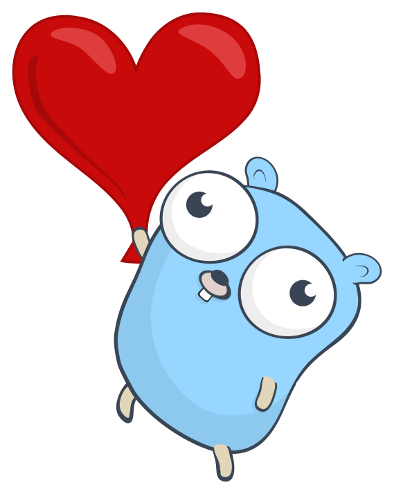

# Golang Simple Applications

This project is a list of simple applications/systems built with **Golang**.

##  List Applications

1. [Hello World app](hello_world.go)
2. [Consume quote package](go_quote.go)
3. Create internal package and unit testing
    - [greeting](golang-greet) API to use random greeting messages
    - [bytesize](golang-bytes) API calculates byte to KB, MB, GB, TB, and PB

##  Contributing

Pull requests are welcome. For major changes, please open an issue first to discuss what you would like to change.

##  Credits

The images, svg icons and gif animations are from [Gophers](https://github.com/egonelbre/gophers)

Copyright :copyright: 2022. This project is under [CC0](LICENSE) licensed.
